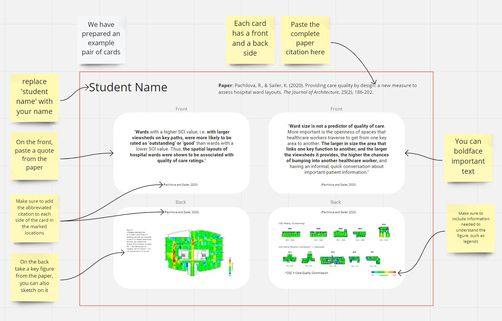
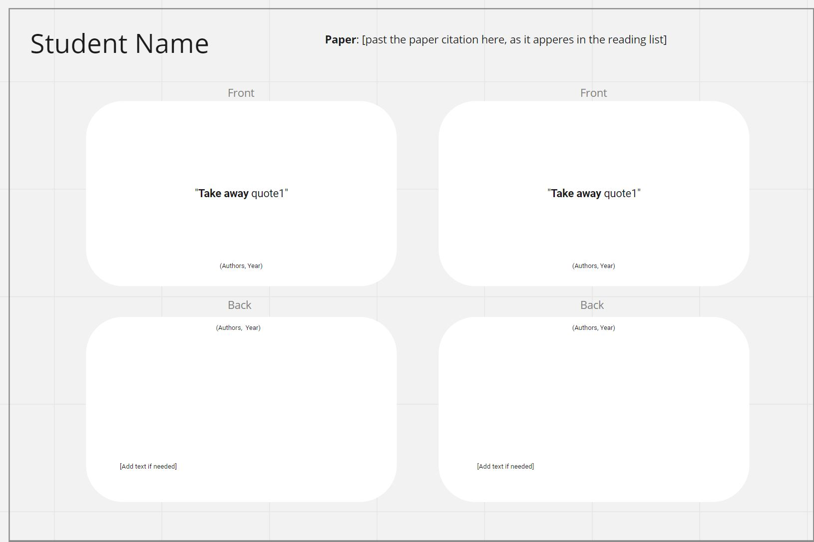

# Reading on Evidence-Based Design for Healthcare

## Submission Details 
- **Submission date**: 13.03.2024, 17:59 CET
- **Submission materials**:
  - A presentation on the paper (10 slides, 5 minutes max). File name: Your group members last name delimited by `_`. Example: If your group consists of _A. Einstein_, _M. Curie_ → `einstein_curie.pdf`. [Upload link](https://polybox.ethz.ch/index.php/s/GNCvC6Vo6zLpJbI)
  - Evidence-Based Design cards. [Miro link](https://polybox.ethz.ch/index.php/s/3WihQVlWgbSG1w0)
- **Presentation date**: 13.03.2024 in class
- **Grading**: Total of 100 points, 80 points for the presentation, 20 points for the cards. The presentation will be evaluated according to the following criteria:
  - Clarity of the presentation
  - Depth of the analysis
  - Quality of the discussion of the relevance of the proposed results to architectural design

  The cards will be evaluated according to the following criteria:
  - Relevance of the selected quotes
  - Selection of the figure
  - Adherence to the template and visual appeal

## 1.1 Reading Assignment (80 points)

In this exercise, you will have the chance to work in groups of 2 students.
You can choose a paper and group up with a classmate in [this spreadsheet](https://polybox.ethz.ch/index.php/s/3WihQVlWgbSG1w0). The papers are classified by building type that they investigate. Note that a paper can only be chosen once by one group.
**You are also allowed to suggest a paper that is not on the list, but please get in touch with the instructors before doing so.**
If you choose your own paper, please add a row to the spreadsheet, analogous to the other papers, and fill in the details of the paper.

The following questions should guide your reading and presentation preparation:
  * Who are the authors?
  * What **questions** does the paper try to answer? 
  * Which **methods** are used to answer the question?
  * What are the **key results** reported? How does it address the initial question?
  * What are the **key design take away messages** from this paper? 
  * **Be critical! What arguments in the paper require more evidence?  Do you agree with the interpretation of the results, do you find the paper relevant for architectural design?**

## 1.2 Evidence-Based Design Cards (20 points)
Based on your reading, prepare two pairs of cards for our **Evidence-Based Design for Healthcare Card Deck**. 
The instructions and template for making the card (as well as an example of two cards) are in the Miro board.
You can see two screenshots from the Miro board below. 

*An example pair of cards*

*An empty template for a pair of cards*