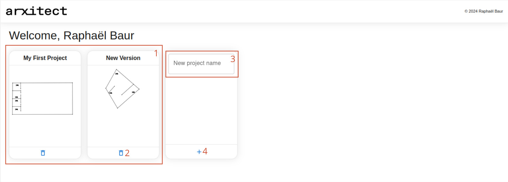
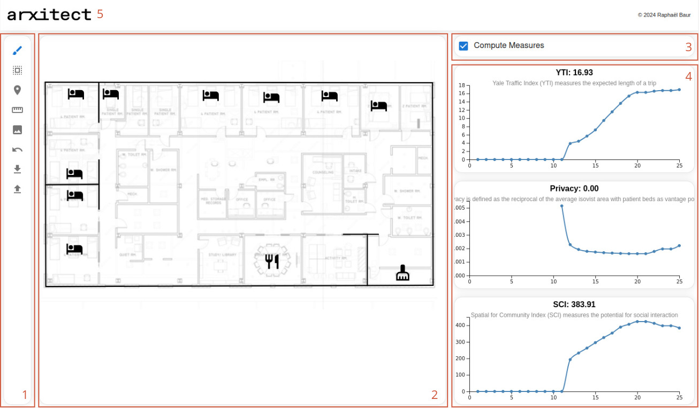

# Topological & Geometric Analysis of Hospital Layouts

## Submission Details
- **Submission date**: 12.11.2024, 23:59 CET
- **Submission materials**:
  - A report on the exercise (at least one page, less than two pages with images). File name: Your group member's last name is delimited by `_`. Example: If your group consists of _A. Einstein_, _M. Curie_ → `einstein_curie.pdf`. [Upload link](https://polybox.ethz.ch/index.php/s/pyGGsPYep9Fko5g)
- **Group size**: Individual assignment
- **Grading**: Total of 100 points. The report will be evaluated according to the following criteria:
  - Clarity of the report
  - Depth of the analysis
  - Quality of the discussion on the impact of the results on architectural design
- **Office hour**: 06.11.2024, during class

The goal of this exercise will be to design an intervention in an existing hospital design such that it will improve at least two of the measures presented in week 5.

## 1. Assignment Overview

The goal of this exercise will be to design an intervention in an existing hospital design such that it will improve two of the measures presented in week 5. In particular, you will be investigating the SCI and the YTI metric. Please refresh your memory by consulting the lecture slides, but we will restate their definition here:
> **Spaces for Communication Index (SCI)**: The Spaces for Communication Index (SCI)  (Pachilova et. al., 2020) is a measure designed to evaluate hospital ward layouts based on their ability to maximize communication opportunities among healthcare workers, as increased face-to-face interactions are linked to a higher quality of care. We compute it as the average area of the isovist when traveling along typical routes in the hospital.

> **Yale Traffic Index (YTI)**: The Yale Traffic Index (YTI) is a network efficiency metric. It corresponds to the expected distance of a typical route of a nurse.

In this task, you will use [arxitect](https://arxitect.ivia.ch), a research prototype for hospital layout design with real-time analytics. The exercise is split into two parts, the first of which is mandatory, and the second of which is optional. In the first part, you will choose a hospital floor plan and perform a design intervention to improve the above-mentioned metrics. In the second task, you will start with a given floor plan and try to improve an overall score given some constraints. You will be able to compare the performance of your intervention with that of other students.

## 2. `arxitect` Tutorial

> `arxitect` is a research prototype, and thus there might still be bugs and issues. Please feel free to email `raphael.baur@ai.ethz.ch` if you experience problems. Also, please suggest ideas for features. We will try to resolve any issues quickly, but we will keep a log of common bugs (that cannot be fixed quickly) here. Please go through the instructions thoroughly before sending an email. **Note that arxitect needs to be connected to the internet to save your progress. If you are offline, you can still use the tool, but you will not be able to save your progress.**

**Known issues or limitations**:
- When creating a project, there are no thumbnails. When leaving the project, the thumbnail is only updated after refresh.

### 2.1 Registration
Please navigate to [https://arxitect.ivia.ch](https://arxitect.ivia.ch) and click **Register**. Currently, you can only use email addresses that end with `@ethz.ch`. After confirming your email address, you will be forwarded to the home page.

### 2.2 The Home Page
The _home page_ is a central hub for creating, accessing, and deleting sketches.

1. Here you can see existing projects. Click on the **title** to open it.
2. You can delete projects.
3. When creating a new project, first choose a name ...
4. ... then add the project by clicking "+".
Create a project and open it.

### 2.3 The Editor
Opening a project will forward you to the _editor_. In the editor, you can draw and edit walls, and add points of interest (short, POIs) to the layout.

1. This is the toolbar. It contains all the relevant tools that you will use to manipulate the layout. We will outline this more in-depth in section 2.4.
2. This is the canvas. It displays the current draft and allows you to interact with it.
3. Here you can activate or deactivate the computation of the metrics. When active, the metrics will be recomputed on each update to the graph. If this takes too long, you can disable the computation for intermediate steps.
4. Here we have a collection of line plots showing the progression of the metrics during the design process. If a metric cannot be computed or their computation is disabled, the line chart will be discontinuous.
5. To get back to the home page, you can click the `arxitect` logo.

### 2.4 Tools
 The **draw** tool allows you to draw walls in the canvas. Left-click () anywhere on the canvas to start drawing a polyline. When hovering over the canvas, you will see the new wall segment drawn. Your wall segment cannot cross other walls. Your mouse will snap to other walls and points if you are close enough. Left-clicking again () will confirm the current segment. Right-clicking () will terminate the current line segment. Hold `shift` while drawing to snap to draw a vertical or horizontal line segment.

 The **select** tool allows you to select existing walls, corners, and POIs. Select any item by left-clicking () on it. Hold the `shift` while selecting to append it to the current selection. Right-clicking and dragging () will allow you to drag and drop your selection. You can also drag and drop corners directly without adding them to the selection first. To select multiple objects, hold `shift` when selecting items. Press `delete` to remove the current selection.

The **POI** tool lets you place points of interest in the layout. Right-clicking () on the  icon will unveil the different types of POIs you can place. Left-clicking () will place the POI. You can drag and drop POIs after placing them.

 The **measure** tool allows you to indicate the _true_ length of a straight line in your layout to calibrate your metrics. Click once to place the first reference point, and click again to place the second reference point. Insert the true distance in meters in the text box that appears.
> Note: Currently, adding a reference length will not recompute your previous measurements. The metrics will only take into account the reference length from the point of insertion onwards. Therefore, it is recommended to add the reference length at the beginning of your design process.

 The **reference image** tool allows you to upload an image of the floorplan you are working on. This will help you to draw the walls more accurately. Click on the icon and select the image you want to upload. It will then be displayed in the background of the canvas. Re-uploading an image will overwrite the previous one.

 The **undo** tool allows you to undo the last action. _Note that there is no redo functionality yet._

 The **download** tool allows you to download the current layout as a `.json` file. This file can be uploaded again to `arxitect` to continue working on your project.

 The **upload** tool allows you to upload a `.json` file to `arxitect`. This will load the layout saved in the file. Please ensure that the file is a valid `.json` file.

## 3. Task 1: Design Intervention

1. **Find a Floorplan Typology**: Find a hospital floorplan online, including information about the architect, year of completion, and patient bed capacity.
2. **Create a New Project**: Use the arxitect tool to create a new project.
3. **Upload Floorplan**: Upload the floorplan using the reference image tool.
4. **Calibrate Distances**: Use the measure tool to calibrate distances, using known elements like scale bars or door widths. Longer distances yield better accuracy.
5. **Trace Walls**: Start tracing walls. You may deactivate metric computation for smoother performance. Approximate rounded shapes with straight lines if needed.
6. **Place POIs**: Add points of interest. Place one POI per function or room type.
7. **Compute Metrics**: Reactivate metric computation. Save the current layout and take a screenshot of the initial state.
8. **Design Intervention**: Perform an intervention to improve both the SCI and YTI metrics. Develop a hypothesis on how to enhance the metrics and test it by implementing the changes. Document your process with screenshots, noting decisions and surprises.
9. **Capture Final State**: Take a screenshot of the final state of the layout.

## 4. Report

The goal of the report is to document your experience with `arxitect`. It should be between one and two pages (excluding images). Include the following:

- **Hospital Characteristics**: Describe the type of hospital, location, year built, architect, and function of the analyzed ward.
- **Status Quo**: Describe the initial layout, noting what works well, what doesn't, and any peculiarities.
- **Hypothesis/Strategy**: Describe your strategy for the design intervention in 2-3 sentences.
- **Design Process**: Document your design process, key milestones, and decisions.
- **Reflection**: Reflect on how analytics-assisted design influenced your experience. Did it engage or hinder you?

## 5. Optional Task: Challenge (Release Date: Upcoming Days)

1. **Create a New Project**: Create a project named `challenge-hs24-your-nickname` where `your-nickname` is your chosen nickname. Ensure the name starts with "challenge-hs24-" for tracking purposes.
2. **Download Starter Layout**: Download the provided JSON file.
3. **Import Starter Layout**: Import the starter layout into your challenge project.
4. **Upload Reference Image**: Download and import the provided reference image.
5. **Calibrate Distance**: Measure the indicated line in the layout. This step is mandatory for valid submissions.
6. **Start Optimizing**: Improve both SCI and YTI metrics. Your score will be the average improvement of both metrics. For example, if you improve the SCI by 10% concerning the starter layout and the YTI improves by 20%, your score will be 0.5 * (10 + 20) = 15. Your score will be the average improvement of both metrics.
7. **Propose Additional Metrics**: If time permits, we will implement proposed additional metrics for evaluation. Approved metrics will be used for all participants.